# Healthy Kid
<h4>This app is useful for all ages mothers. They can find some types of articles. It has lots of features. I have used to Firestore Database and Storage.<h4>

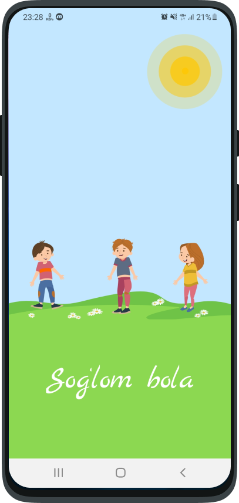 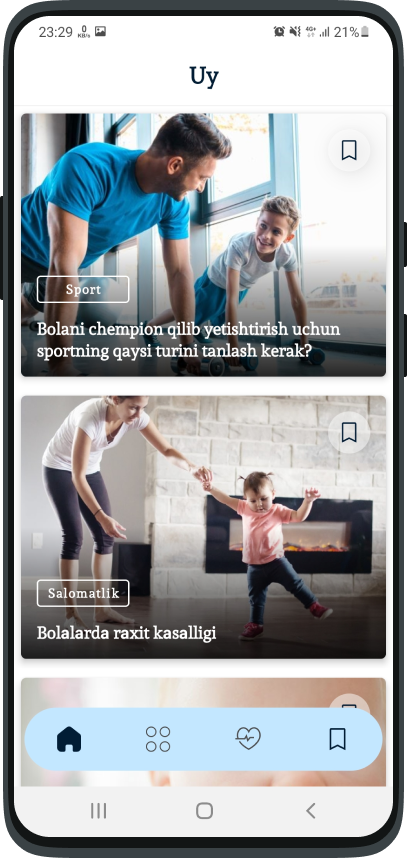 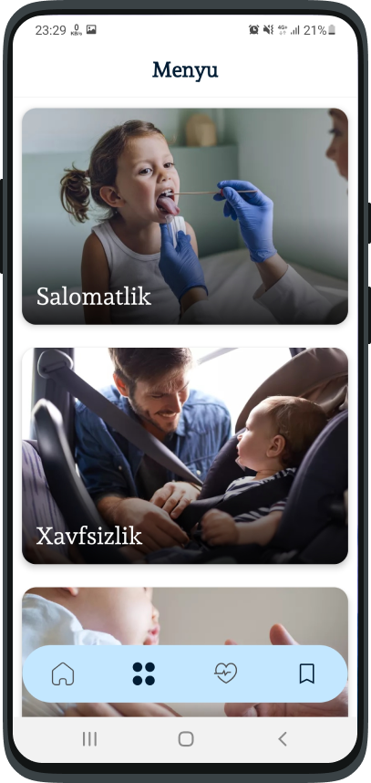
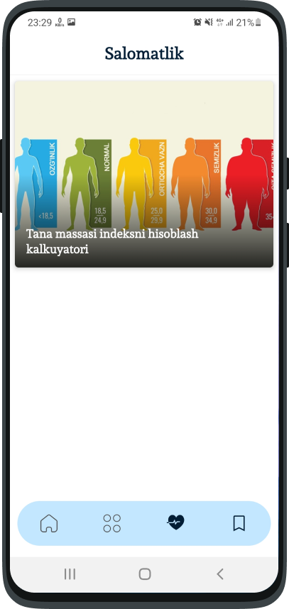 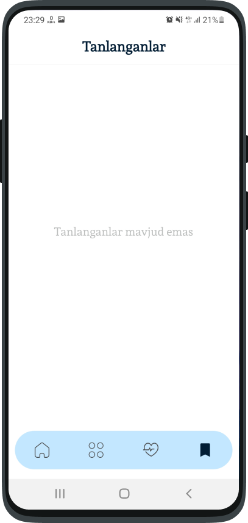 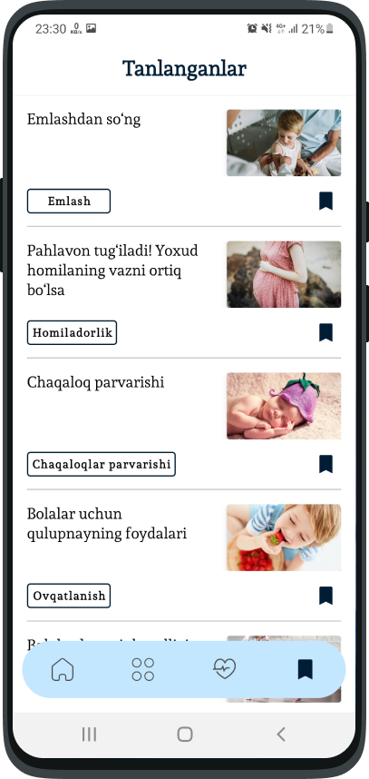
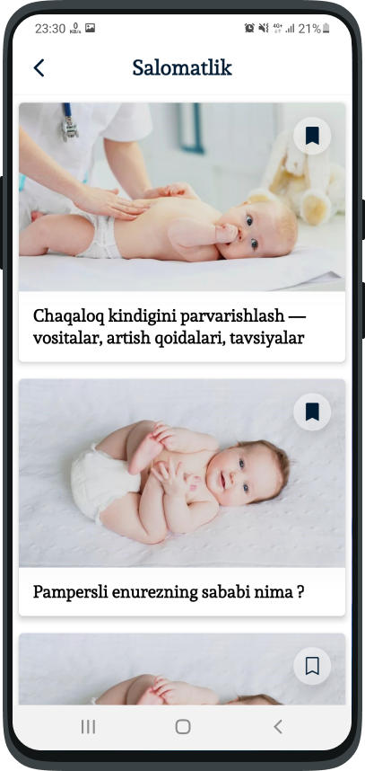 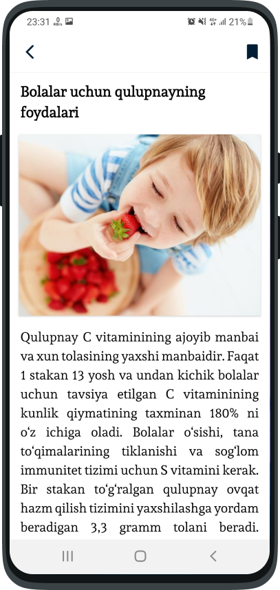 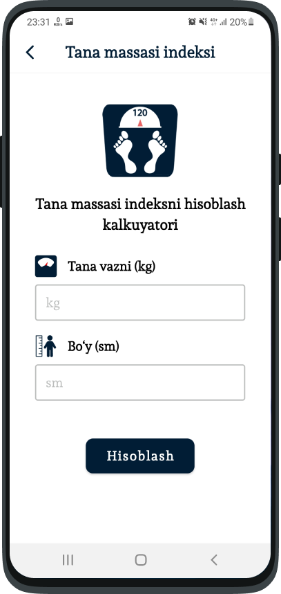
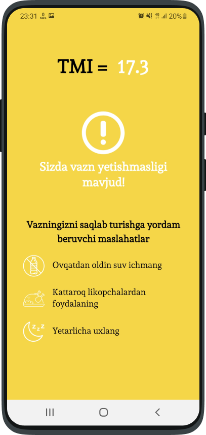 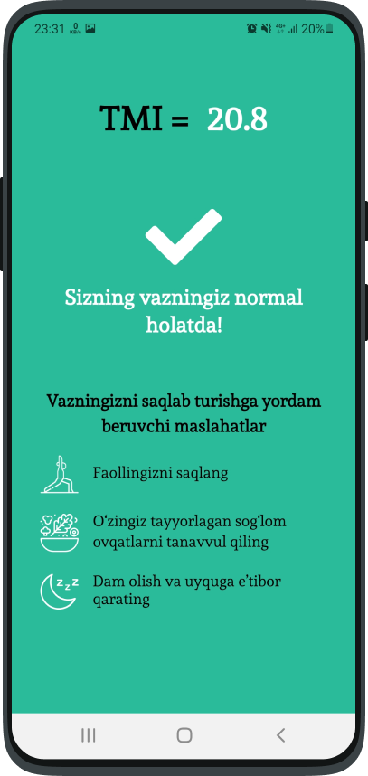 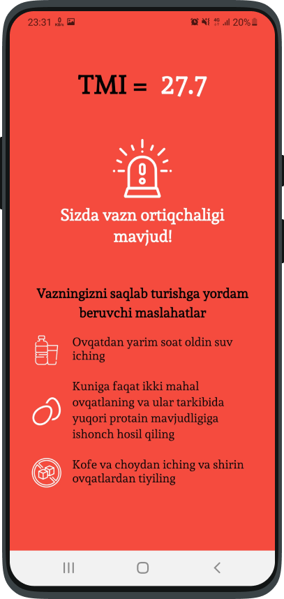
  
# Icons

<h3>I made icon for this app.<h3>

# Resources:
  
<b><a href = "https://lottiefiles.com/74803-enjoy">LottieFiles</a><b>

 <b><a href = "https://www.figma.com/file/5kCMHfG57bSQvJlz4XyBY3/Untitled?node-id=0%3A1">Figma</a><b>
